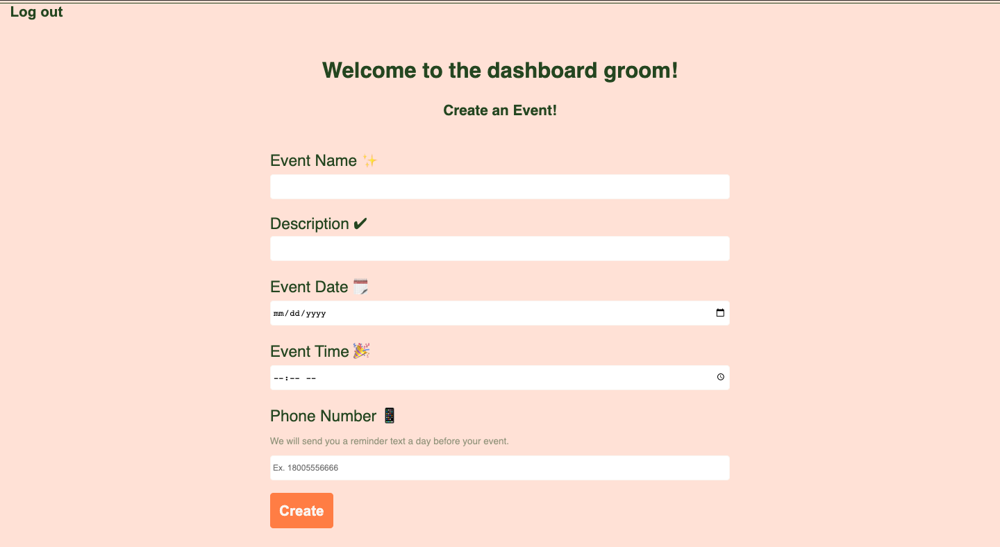

<h1 align="center">💍 Put-A-Ring-On-It 💍</h1>
  

    
    
    
    

  

    
    
    
    
    
    
    

## Description 

Find a spouse with this wedding planner app! The app is a full-stack application deployed using Heroku. 

## Demo

[Link to the YouTube Demo](https://youtu.be/bWwcJCBLOYI)

## Link to Deployed Application on Heroku
[Put A Ring On It | Wedding Planner](https://put-a-ring-on-it.herokuapp.com)

## Table of Contents
* [Technologies](#technologies)
* [Installation](#installation)
* [Usage](#usage)
* [Credits](#credits)

## Technologies
- MySQL2
- Sequelize ORM
- Express
- Handlebars 
- Heroku 
- Node.js
- MessageBird

## Installation
- npm install mysql2 sequelize express handlebars dotenv morgan messagebird
- npm install -g heroku
- heroku --version
- heroku create

## Usage
- Connect to MySQL in the terminal. 
- Use MySQL shell commands:
    - source db/schema.sql
    - use the database: "ring_db"
- Use NPM start
- Go to PORT localhost:3001

## Credits
- Group collaboration
- Trilogy Course Material, Instructor, and TAs

## Contributors
- [alexandraws29](https://github.com/alexandraws29)
- [1jorcarver](https://github.com/1jorcarver)
- [bdrawe](https://github.com/bdrawe)
- [salgorog](https://github.com/salgorog)

Please note that this project is released with a Contributor Code of Conduct. By participating in this project you agree to abide by its terms.

